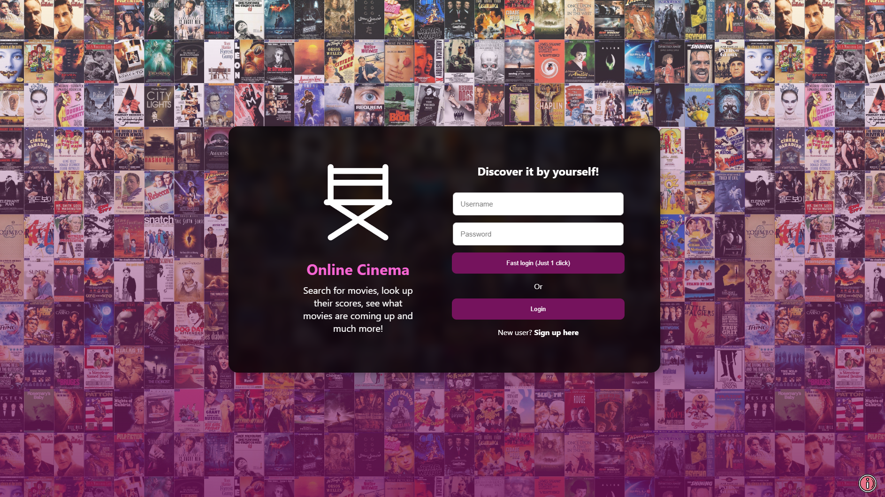

## :rocket: Movie-App


### :memo: Description
Movie-app it's an application where you can find all the information about
movies throught the IMDB service. You can register or login and save your preferences. The backend its created in Nodejs (Express with Typescript)


### :sparkles: Features
- Login
- Register
- Search Movies
- Top 250 Movies in the History
- Premiers movies (In theatres)
- Coming soon movies
### :alembic: Core Concepts
- Redux
- Patterns (Facade, Strategy, Observer)
- Orchestrate APIs
- BEM methodology
- Clean Code
- Promises, Observables.
- LazyLoad on scroll.
- Swiper to characters in movies.
### :construction: Made with
- angular 12
- ngrx 12
- ngx-infinite-scroll 10
- rxjs 6
- swiper 7

- Backend with Express and Typescript (separate repository ).

### :hammer: Demostration
- Link: https://cinema-application.netlify.app/login
- Video: https://youtu.be/4HcVUCw4Q-w



### :bulb: Run the App
To run locally, clone the repo, execute ```npm install``` and then ```ng serve --open```.

*If you want to contribute to improve the project, please create your PR and write me :speech_balloon: . After it, sit down and take a beer, you deserve it!* :beers: .
*This project is for academic purposes only, all right reserved. Andrés Andrade 2021 :copyright::registered:*
